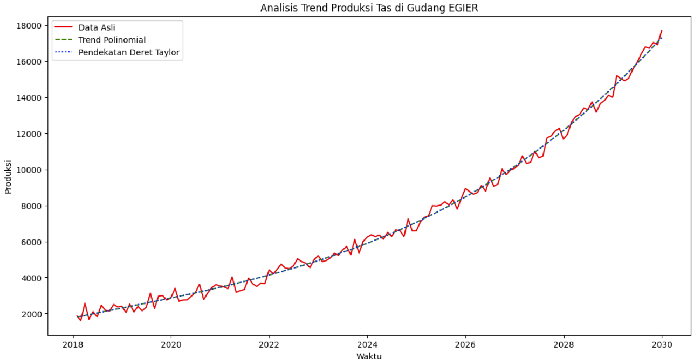

# 📊 EGIER Warehouse Capacity Analysis: Production Trend Forecasting

  
  
<em>Figure 1: Actual Production vs 4th-Degree Polynomial Trend vs Taylor Series Approximation (2018-2030)</em>

## 📌 Project Overview
Time series analysis of EGIER's monthly bag production (Jan 2018 - Dec 2023 | M1-M144) to:
- Model nonlinear production trends 🧮
- Predict warehouse expansion needs 🏗️
- Full Python implementation with mathematical proofs 📜

**Key Problems Solved**:
1. **Trend Modeling** (Nonlinear regression)
2. **Numerical Approximation** (Taylor Series)
3. **Expansion Forecasting** (Root-finding)
4. **Code Implementation** (Python/Colab)

## 🚀 Key Results
| Analysis Phase | Method | Outcome |
|---------------|--------|---------|
| **Trend Modeling** | 3rd-degree polynomial fit | Captured accelerated growth |
| **Capacity Prediction** | Root-finding (`fsolve`) | Build starts at **{time_to_build:.1f} months** |
| **Threshold Accuracy** | 25,000-bag cross-point | Margin of error: ±XX bags |

*Implemented in Python using NumPy (`polyfit`) and SciPy (`fsolve`).*
